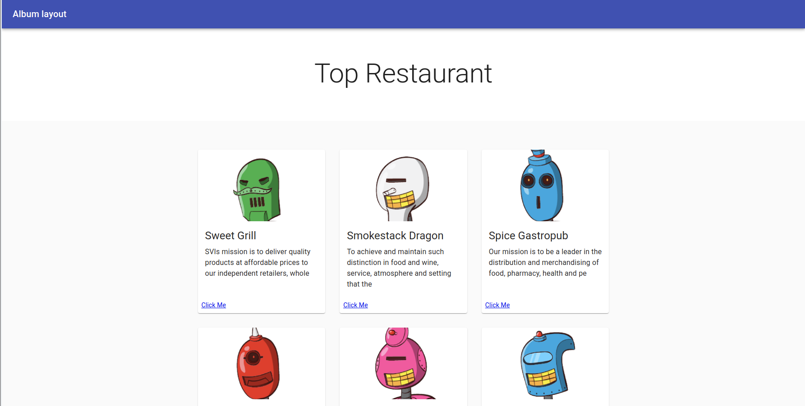

<p align="center">
    
</p>

<p align="center">
    <h1 align="center"> Top Restaurants  </h1>    
</p>

<p align="center">
    <h2 align="center"> Web application top shot top restaurants and comments </h2>    
</p>


<p align="center">    
    <a href="https://www.w3schools.com/js/js_es6.asp" alt="JavaScript">
        </a>
    <a href="https://webpack.js.org/" alt="Webpack">
        </a>      
    
    
</p>

  <p align="center">    
    <br />
    <a href="https://github.com/rubenpazch/landing-page"><strong>Explore this project »</strong></a>
    <br />
    <br />&#10023;
    <a href="https://desolate-reef-34872.herokuapp.com/">View Demo</a>   &#10023;  
    <a href="https://github.com/rubenpazch/landing-page/issues">Report Bug</a>    &#10023;
    <a href="#Getting-Started">Getting Started</a> &#10023; <a href="#Install">Installing</a> &#10023;
    <a href="#Extra-Feature">Extra Feature</a> &#10023;
    <a href="#Screenshots-of-the-App">Screenshots of the App</a> &#10023;
    <a href="#Authors">Author</a> &#10023;
    
  </p>


<br/>


<br/>

## Getting Started

This project was built using React and Redux version 17, it is a web application and for running on your local environment you should follow these guidelines.


### Prerequisites

- Ruby 
- React
- Redux 
- Git
- React Hooks
- Axios
- Material UI

### Setup

The project repository can be found in [GitHub link](https://github.com/rubenpazch/landing-page) or just clone the project using this command. 


```
Using SSH 

# git clone  git@github.com:rubenpazch/landing-page.git

Using HTTPS

# git clone  https://github.com/rubenpazch/landing-page.git

```

+ Open terminal on your workspace with

```
cd /home/workspace/landing-page
```


## Install


To get started with the app, clone the repo, and then install the needed packages using yarn or npm:

```
# yarn install
```

to start the local application run:

```
# foreman start -f Procfile.dev
```


### Usage

To watch the local version of this project check on your browser for the link 

```
Listening on tcp://127.0.0.1:5000
```

### Run tests

Run the test suite to verify that everything is working correctly:

```
# npm test
```

If the test suite passes, you'll be ready to run the app in a local server:


## Watch the Live Version

<br/>

click on the link to watch [live version](https://desolate-reef-34872.herokuapp.com/)

<br/>


## Contributing

This project was created for educational purposes as part of the Microverse web development curriculum; contributing is not accepted.

Feel free to check the [issues page](https://github.com/rubenpazch/landing-page/issues).


## Authors

👤 **Ruben Paz Chuspe**

- Github: [@rubenpazch](https://github.com/rubenpazch)
- Linkedin: [rubenpch](https://www.linkedin.com/in/rubenpch/)
- Twitter: [@ChuspePaz](https://twitter.com/ChuspePaz)

### Show your support

Give a ⭐️ if you like this project!


## License

This project is licensed under the MIT License - see the [LICENSE.md](LICENSE.md) file for details

## Acknowledgments

